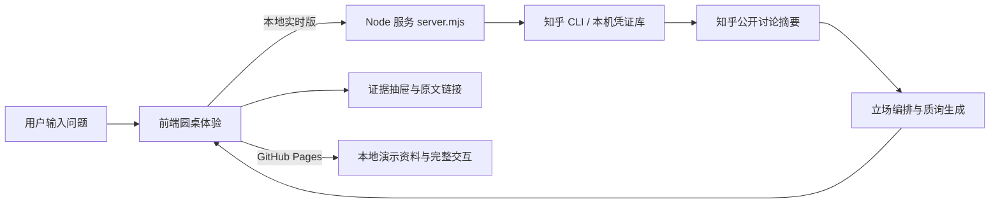

# 看山圆桌产品说明计划书

## 项目定位

看山圆桌把知乎上“同一问题下有多种高质量回答”的阅读体验，转化为一场可参与的多观点圆桌。产品不替用户给出唯一结论，而是帮助用户看见立场、证据、反驳条件和自己的判断变化。

项目以知乎 IP 刘看山担任主持人。他邀请观点入席、提示当前讨论任务，并在关键节点把用户从“看答案”引导到“理解理由”。

## 核心创作思路

知乎的价值不仅在单条高赞回答，也在不同经验、专业背景和价值取向间的张力。长答案和评论流让用户常常难以判断：哪些回答真正持有不同立场、依据是什么、该追问谁，以及阅读后自己是否改变想法。

看山圆桌将这些阅读动作拆成三回合：陈述、质询、总结。每一席都关联知乎公开讨论的摘要与原文入口；旁听者可以理解分歧，参与者则能以第四席身份记录初始与最终观点。圆桌纪要把“看过什么”变为“我因此怎么想”。

## 用户与场景

| 场景 | 用户问题 | 产品价值 |
| --- | --- | --- |
| 学习决策 | AI 编程普及后还要系统学基础吗？ | 并列呈现基础、实践、分层选择，帮助用户选取适合自己的学习路径。 |
| 职业选择 | 转行应先做作品集还是先补理论？ | 通过质询暴露建议的适用条件，避免照搬单一经验。 |
| 公共议题阅读 | 一个社会议题有哪些合理分歧？ | 回链原文和完整语境，减少断章取义与情绪对立。 |
| 社区运营 | 怎样让优质回答产生持续讨论？ | 将静态回答扩展为可参与、可回顾、可分享的内容单元。 |

## 核心体验

### 两种参与方式

- **置身事外**：先听三方陈述；第二回合可追问，也可直接查看总结，适合快速理解问题。
- **置身事内**：先写初始观点，向一席提出问题，再记录最终判断，适合形成个人决策。

### 三回合结构

| 回合 | 用户任务 | 系统呈现 |
| --- | --- | --- |
| 陈述 | 理解三方结论和依据 | 三个席位、开场陈述、知乎证据入口 |
| 质询 | 对一位嘉宾提出具体问题 | @ 角色、思考状态、基于证据的回应 |
| 总结 | 带走自己的判断 | 三方边界、用户观点变化、圆桌纪要 |

### 视觉表达

三位嘉宾位于圆桌后侧，用户席位位于近侧，形成真实围坐关系；刘看山在桌侧以动图和气泡参与主持。米白、木色与灰绿色搭配宋体标题和简洁正文，让界面更接近安静的阅读室，而非竞赛式辩论。

## 技术实现方案

### 前端

- 原生 HTML、CSS、JavaScript，无框架依赖；
- 状态机控制三回合、两种模式、角色发言/思考状态和输入限制；
- 角色名帖、对话与证据抽屉根据立场计划同步更新；
- API 不可用时自动降级到演示资料；
- 桌面与手机自适应，不需要手动调节分栏。

### 本地服务与内容安全

- `server.mjs` 在本地调用知乎 CLI，检索公开讨论；
- 立场编排只使用本次检索摘要，并验证引用 ID；
- 模型输出经过长度、结构和文本清理再进入前端；
- Access Secret 留在知乎 CLI 的本机凭证库，永不进入浏览器或仓库。

### 公网演示与生产路径

GitHub Pages 负责静态互动 Demo，能完整展示视觉、角色和三回合流程，但不能执行 Node 服务或保存凭证。正式实时版本应将检索和生成层部署在受控 Node.js/Serverless 后端，前端通过 HTTPS 调用 API；密钥应存入秘密管理服务，并增加限流、缓存、审核与可观测性。

## 与知乎社区生态的契合度

看山圆桌不替代知乎问答，而是成为回答的“讨论编排层”。输入来自社区已有的公开讨论，输出仍回链原回答，帮助优质内容更清晰地被理解和继续讨论。

1. **尊重多元观点**：不把高赞答案压缩成唯一正确结论，而是呈现不同条件下的取舍。
2. **增强优质内容可读性**：用立场聚类和证据关联降低复杂议题的进入门槛。
3. **保持来源可追溯**：每个席位都可打开证据抽屉并回到原文核验。
4. **把消费变成参与**：旁听者可以自然升级为提问者和第四席，观点变化成为个人阅读结果。
5. **适配高讨论度问题**：科技趋势、职业学习、公共议题和生活选择都适合以圆桌承接高质量分歧。

## 衡量指标与迭代

| 阶段 | 重点 | 预期结果 |
| --- | --- | --- |
| Demo 完善 | Pages、演示问题、分享卡片 | 方便评审和用户快速体验核心流程 |
| 实时后端 | 云端检索、缓存、限流与可观测性 | 支持安全、稳定的真实讨论编排 |
| 社区能力 | 追问沉淀、纪要分享、专题圆桌 | 形成可持续传播的内容单元 |
| 个性化 | 关注领域、阅读历史、观点变化 | 提升问题推荐和参与相关性 |

建议重点观察完成圆桌比例、质询转化率、证据抽屉打开率、原文回链点击率和最终观点提交率。

## 当前范围与限制

当前版本用于验证核心交互。知乎来源基于公开搜索摘要，立场生成不等同于对完整原回答的事实裁决；关键论据应通过原文链接核验。GitHub Pages 是静态互动演示，实时检索仅能在已配置知乎 CLI 的本地或未来受控后端中提供。
