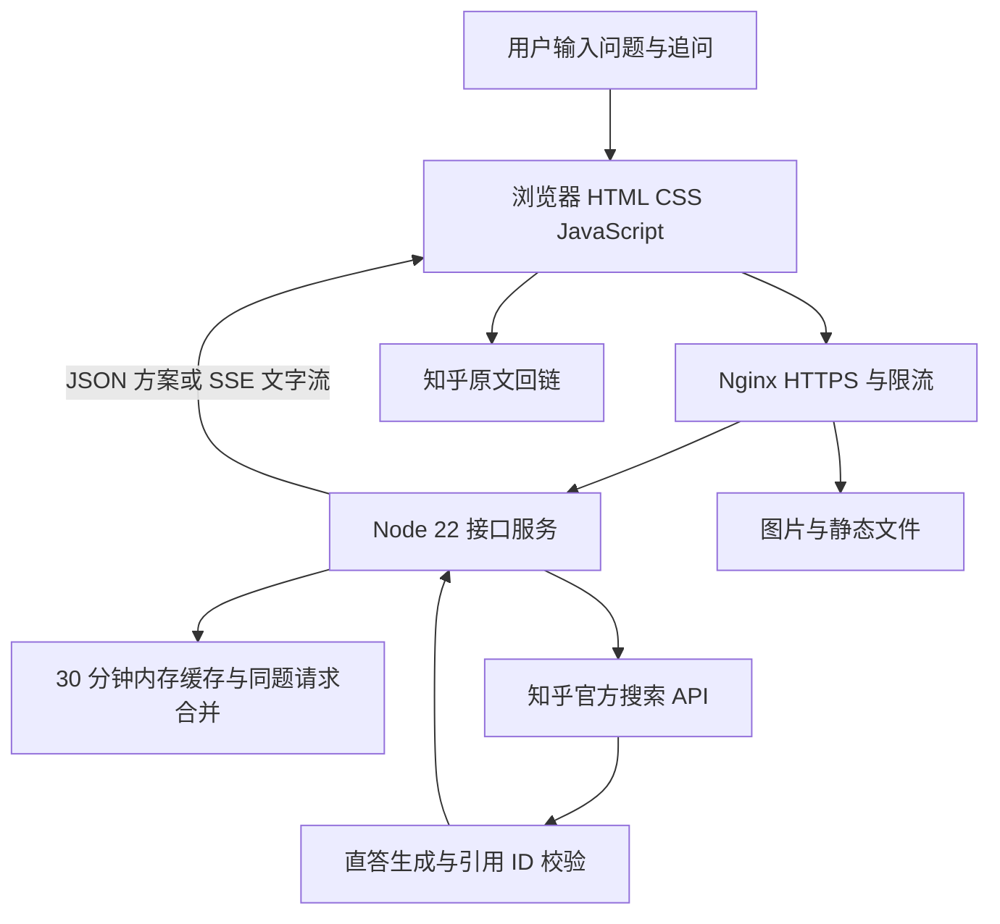

# 看山圆桌产品说明计划书

版本日期：2026 年 9 月 14 日

作品：https://roundtable.xiaoshixuji.xyz/

视频：https://roundtable.xiaoshixuji.xyz/submission/video.html

## 1 项目概述

看山圆桌是一款面向知乎问答阅读场景的多观点讨论原型。用户输入开放问题后，系统检索知乎公开讨论，组织三种可追问的立场，由刘看山主持陈述、质询和总结。用户可以旁听，也可以作为第四席记录初始观点与最终判断。作品希望把“读过几个答案”转化为“理解分歧并形成自己的判断”。

当前已有公网可运行版本，支持真实知乎检索、来源回链、两种参与模式、三回合流程、流式追问和角色立绘联动。它是独立部署的社区体验原型，尚未接入知乎账号、站内发布或社区运营后台；下文将已实现能力与未来社区接入设想分开说明。

## 2 产品目标与范围

| 当前目标 | 当前范围边界 |
| --- | --- |
| 让用户对比不同主张和适用条件 | 不把生成结果当作唯一正确结论 |
| 让每个席位具有可核验的知乎来源 | 不模拟原回答作者亲自参与辩论 |
| 让旁听和参与各有明确的完成路径 | 不强迫旁听用户发言或站队 |
| 在公网完整体验检索与质询闭环 | 未实现站内发帖、登录与会话持久化 |

## 3 创作思路与知乎社区价值

知乎问答适合承载有经验差异和条件差异的问题。阅读同一问题下的多个回答时，用户不仅需要知道结论，还需要弄清“对谁有效、依据是什么、哪些情况不成立”。单一摘要容易抹平差异，评论追问又可能分散在不同回答下。看山圆桌用明确席位承载不同主张，让追问拥有对象，让每种立场保留边界。

以“AI 编程工具普及后，初学者还应系统学习编程基础吗”为例，用户可以比较基础学习、工具实践与综合路径，追问“如果 AI 能生成测试，还需掌握什么”，再回到知乎原回答核验依据。价值在于帮助用户识别建议的适用条件，而不是宣布某一席获胜。三种立场由本次检索生成，并不保证所有问题都有三个同等合理的答案。

学习与职业选择是首批适配场景。对“先做项目还是先学理论”“转行先补基础还是先做作品集”等问题，席位可以承载不同经验，追问揭示时间、基础与目标的差别。预期价值是减少照搬结论，让用户带着更具体的问题回到原文。

对社区内容供给，看山圆桌把既有回答组织成可继续阅读的入口：显示作者与摘要，引用链接回到知乎，帮助优质内容在跨回答比较中被发现。当前只实现回链，尚未验证能带来多少原文访问或作者互动，不把预期收益写成已发生的增长。

刘看山承担主持职责：检索时提供思考提示，回合间说明下一步，发言时提示先听理由，结束时鼓励保留自己的判断。它把流程规则转成轻量陪伴，延续知识讨论的语境。米白、木色与灰绿营造阅读室氛围，降低竞技式辩论的对抗感。

对潜在运营场景，可围绕高讨论度问题策划专题圆桌，把优质回答、可追问的分歧和阅读纪要串联起来；对创作者，可让用户先理解观点边界再进入原文交流。这些站内合作与分享能力属于后续接入方向，当前 Demo 不自动向知乎发布任何内容。

## 4 整体技术架构

线上数据流：用户输入 → 浏览器圆桌界面 → 同域 Node 服务 → 知乎官方搜索与直答 API → 结构校验与引用关联 → 三席呈现与证据回链。

## 核心组件与职责

| 组件 | 职责 | 依赖或状态 | 异常处理 |
| --- | --- | --- | --- |
| 浏览器界面 | 三回合与两种模式；证据和角色联动 | 页面内会话 | 标明演示回退；保留断流内容 |
| Node 服务 | 搜索、编排、校验和 SSE 转发 | 内存缓存与同题合并 | 超时、输入校验和并发限制 |
| 知乎官方接口 | 公开搜索与直答生成 | 服务端 Access Secret | 上游不可用时返回明确错误 |
| Nginx | HTTPS、素材直供、API 代理 | 静态资源与证书 | 素材缓存；限流返回 429 |
| systemd | 独立服务进程与自动重启 | Node 22 与受限运行账号 | 服务恢复后重新生成失效缓存 |

## 5 用户体验与请求流程

输入问题后选择模式。置身事外允许旁听、追问或直接看总结；置身事内先记录初始立场，至少追问一席后再形成最终判断。

浏览器请求同域 Node 接口。服务端校验问题长度，检查缓存并合并相同问题的并发请求，再调用知乎官方搜索接口。

后端基于检索摘要生成立场名称、主张、开场、反驳思路、总结与引用 ID，并校验结构及引用关系；生成失败时可使用基于来源的后备编排。

检索期间，刘看山轮换思考提示，用户可手动换个角度。等待时长真实计时；完成后，三位嘉宾依次逐字陈述，思考、发言和待机立绘随之切换。

第二回合通过 @ 选择嘉宾。后端将问题、来源、当前立场和本次追问发送给生成服务，通过 SSE 把文字增量传回浏览器；界面平滑展示内容并标明断流。

第三回合展示各方总结和边界，参与者填写最终立场。圆桌纪要在当前页面汇集各方判断，并并列呈现用户前后观点；当前未提供持久化个人档案。

点击引用可打开证据抽屉，查看作者、摘要和知乎原文入口。音效为可选短提示，默认关闭；支持直接显示本轮全文，减少动态效果设置下不逐字等待。

## 6 接口与数据约定

## 关键输入与输出

| 字段 | 类型 | 约束 | 用途 |
| --- | --- | --- | --- |
| question | 文本 | 4 至 120 字符 | 本场问题；方案缓存索引 |
| position | 枚举 | a / b / c | 选择追问席位 |
| message | 文本 | 非空且至多 1000 字符 | 当前追问内容 |
| sources | 数组 | 来自本次搜索 | 来源 ID、标题、作者、摘要与 URL |
| positions | 数组 | 校验三席结构 | 名称、主张、开场、总结与来源 ID |
| sourceIds | ID 数组 | 匹配 sources | 生成观点与原始来源建立关联 |
| SSE 事件 | 事件流 | status / delta / done / error | 传递等待状态、可见文字与完成或失败 |

## 数据与呈现约束

生成的引用 ID 必须对应本次检索返回的来源；前端通过 ID 关联证据，避免凭空生成原文链接。

开场和总结在完整方案通过校验后逐字展示；追问才使用上游实时增量输出，两者的实现方式明确区分。

服务端只把可见回答内容传给前端，不展示模型推理字段。模型生成的角色发言是观点重组，不是原作者实时发言或逐字引述。

搜索摘要提供讨论线索，不等于完整原文或事实裁决。需要判断关键论据时，用户应回到知乎原文查看上下文。

实现代码与接口约定见项目仓库：

https://github.com/youranwang-hub/zhihu-kanshan-roundtable

## 7 稳定性与失败恢复

线上采用单实例 Node 服务。相同问题的方案缓存 30 分钟，正在生成的同题请求合并；缓存存于内存，服务重启会失效。页面会话同样未持久化。限流和并发限制用于控制演示成本，当前没有作高并发容量或可用性承诺。

| 情况 | 界面或服务行为 | 目的 |
| --- | --- | --- |
| 重复检索同一问题 | 复用有效缓存，合并进行中的请求 | 减少上游重复调用 |
| 搜索或编排不可用 | 标注使用已有资料或本地示例 | 保留可体验流程并说明数据状态 |
| 追问中途断流 | 保留已收到文字，提示重新追问 | 避免把不完整回答当作正常结束 |
| 素材失败或状态切换 | 有限重试；新立绘成功后再替换 | 减少空白和旧请求覆盖新状态 |

## 8 来源与凭证保护

公网前后端同域并使用 HTTPS。知乎 Access Secret 仅存于服务器受限目录，由服务端调用官方接口，不下发浏览器，不提交仓库。

页面只展示公开检索结果中的来源信息。追问会发送给后端和生成服务；当前无账号体系，也未实现跨会话的私人阅读历史。

静态服务限定公开文件范围。Nginx 直接提供图片，API 由 Node 处理；运行日志不直接输出上游秘密，API 访问日志已关闭。

模型文本以纯文本方式渲染，接口做长度与结构校验，防止把生成内容作为页面代码执行。服务进程使用独立低权限账号运行。

进入更广泛社区试用前，需要完善内容审核、数据留存说明、用户反馈和删除机制。现阶段不声称具备生产级治理能力。

## 9 验证现状与评估指标

| 项目 | 当前证据或指标定义 | 现状 | 后续验证 |
| --- | --- | --- | --- |
| 功能回归 | 6 项自动化测试通过 | 已完成 | 改动后持续运行 |
| 真实数据链路 | 示例问题返回 9 条来源；追问返回多段 SSE | 已实测 | 扩充不同领域样本 |
| 阅读完成 | 完成第三回合人数 / 开始讨论人数 | 待采集 | 区分旁听与参与 |
| 证据回访 | 点击知乎原文人数 / 开始讨论人数 | 待采集 | 评估社区回流价值 |
| 质询参与 | 提出追问人数 / 进入第二回合人数 | 待采集 | 同时检查追问质量 |

以上实测为开发验证，不代表大规模用户研究或服务等级承诺。尚无增长、留存和商业转化数据。

## 10 方案比较与设计取舍

| 方案 | 可取之处 | 本项目取舍 |
| --- | --- | --- |
| 单答案摘要 | 阅读时间短，入口简单 | 采用多席表达，保留条件差异和追问对象 |
| 无限轮自由聊天 | 用户表达自由 | 采用三回合减少迷失；后续再扩展连续追问 |
| 只做静态网页 | 部署简单、成本低 | 保留静态演示，主作品使用云端真实检索 |
| 每字提示音与持续动画 | 表现活跃 | 使用少量可关闭短音，角色状态随发言变化 |

## 11 现阶段限制与待验证问题

来源覆盖是否充分：搜索摘要和固定三席可能遗漏少数经验或把相近立场拆开，需要结合人工抽样和用户反馈校正。

追问是否持续有效：当前每次追问使用来源、立场和本次问题，尚未把完整多轮质询历史发送给模型，长期一致性有待增强。

体验是否稳定：小型服务器带宽、上游耗时和浏览器差异仍会影响体验。已有素材重试、缓存和限流，但未完成系统性弱网及压力测试。

社区接入如何验证：专题圆桌、账号身份、纪要分享与站内讨论沉淀均为后续设想，需要确认产品入口、接口条件和真实用户需求。

## 12 实施计划与后续迭代

首阶段先验证“多观点阅读能否促成有依据的追问”。计划围绕学习与职业选择议题开展小范围试用，记录流程完成、原文回访和用户理解反馈，再决定是否扩展到专题圆桌。后续阶段以测试结果推进，不把规划功能列作本次已交付成果。

| 阶段 | 交付内容 | 验证标准 |
| --- | --- | --- |
| 已完成 | 公网 Demo、来源回链、三回合、流式追问 | 示例链路与自动测试通过 |
| 下一阶段 | 弱网验证、加载监测、内容抽样与追问上下文 | 记录问题复现与修复结果 |
| 小范围试用 | 学习与职业话题试用及反馈收集 | 能观察完成率、质询和原文回访 |
| 后续探索 | 专题圆桌、纪要分享和社区入口接入 | 确认需求与接口条件后再实施 |
